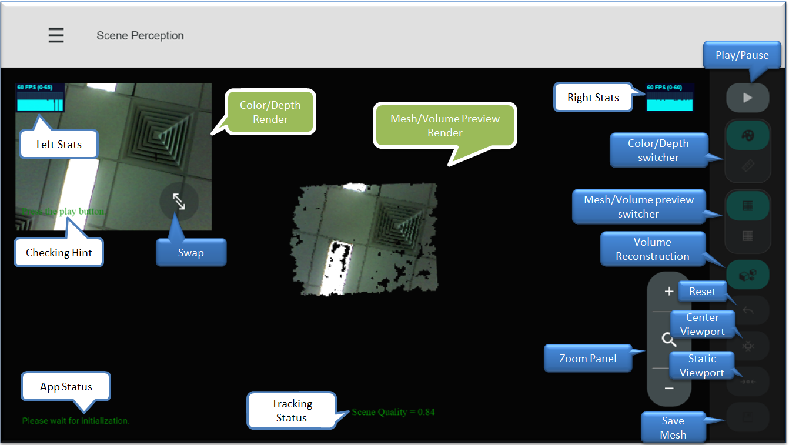

## Scene Perception Sample

### Intruduction
This sample illustrates the reconstruction cabability of Scene Perception module(SP).

The GUI of the sample application is similar to the following figure.

In this sample, it will try to get the camera first to initialize SP module, then the input color/depth images will be processed to get the camera pose, mesh data, volume image etc. We use the mesh data in this sample to reconstruct the scaned scene.

When running the sample application, the camera needs to be oriented to some scene between 0.5-2.0 meters in front of the camera. Best scenes are indoor scenes such as a table top or a desk with enough structures/textures etc. Scenes with only flat unicolor walls or reflective materials (screens) or full of black objects do not reflect the emitted IR light, and therefore do not work well.

As showed in the figure, this sample displays the input RGB or depth in the left-top render and the reconstruction result of the scene as a mesh representation of the surface or a projected (ray-casted) view of the volume space.

In Mesh/Volume Preview Render, the reconstructed scene can be examined in different viewpoints, user can change view port by mouse dragging.
There are also some control buttons and hint logs to show the status.

### Operations
All the buttons will be active if SP module has been initialized successfully, and the *Play button* will only be avaliable if the *Scene Quality > 0.25*. Please refer to the *Checking Hint* to start the reconstruction process.  
* Buttons
  * Play/Pause button, start or stop scene perception.
  * Color/Depth switcher, toggle the RGB or depth image in the left-top render.
  * Mesh/Volume preview switcher, toggle recontructed mesh scene or volume preview image in the main render.
  * Volume Reconstruction button, toggle the volume reconstruction state. Mesh data will not be updated if it was unset.
  * Reset button, reset scene perception.
  * Center Viewpoint button, center/Reset the camera viewpoint in the mesh/volume preview render after changing the viewpoint by mouse dragging.
  * Static Viewpoint button, freeze/unfreeze the camera viewpoint in the mesh/volume preview render.
  * save button, save the mesh data to an OBJ file, the path of the saved file will be showed in *App Status* hint.
  * Zoom Panel, zoom in or zoom out the 3D reconstructed scene display.
  * Swap button, hide or show the color/depth render.

* Hints
  * Left Stats, display FPS in the color/depth render.
  * Right Stats, display FPS in mesh/volume preview render.
  * Checking Hint, some instructions or hints to start reconstruction process.
  * Tracking Status, show tracking quality during reconstruction.
  * App Status, some log or fatal error message will go here.

### Known issues
* On HP spectre x2 2-in-1 laptop, it is somehow difficult for SP module to get high tracking qulity to start the sample. Please be patient to adjust the camera smoothly to get a suitable scene to play with the sample.
* Mesh/Volume switcher has the sampe icon for the both views.
* Volume preview image may be lost while changing viewpoint by mouse dragging, please center/reset the viewpoint to get it back.
